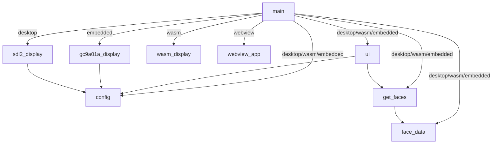
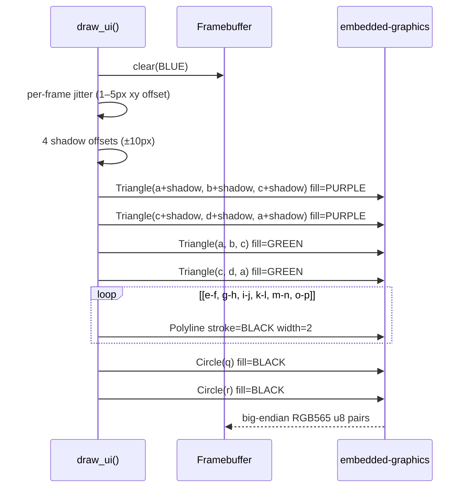
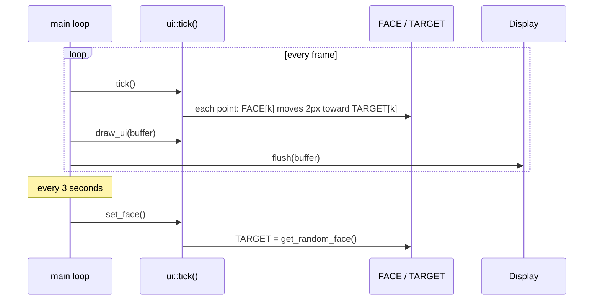
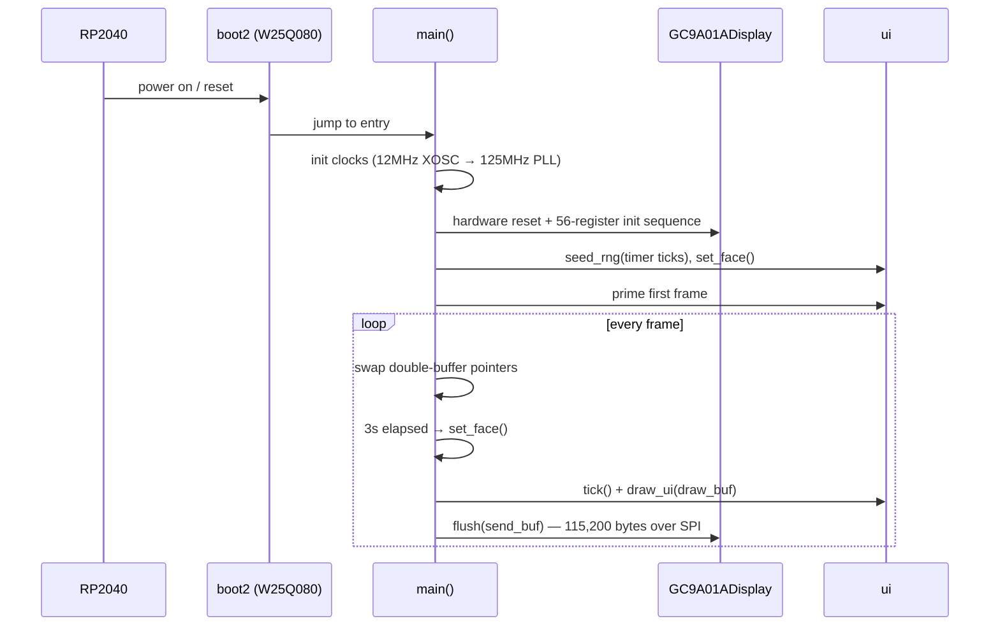

# lilbud

Lil Bud is a tamagotchi-inspired character written in Rust. He is a small animated face that smoothly morphs between expressions, drawn from face data generated by [lil bud maker](https://github.com/zapplebee/lilbudmaker).

He runs on a [Waveshare RP2040-LCD-1.28](https://www.waveshare.com/rp2040-lcd-1.28.htm) — a 240×240 round GC9A01A display on a tiny RP2040 board, worn like a pin. The same code also runs as a native macOS app and in the browser.


---

## Download

Grab the latest macOS app from [Releases](https://github.com/zapplebee/lilbud/releases).

Unzip and double-click `lilbud.app`. First launch: right-click → Open (unsigned binary), or:

```sh
xattr -d com.apple.quarantine lilbud.app
```

---

## Stack

### Hardware

| Component | Part |
|-----------|------|
| MCU | Raspberry Pi RP2040 (dual-core Cortex-M0+, 133 MHz) |
| Board | [Waveshare RP2040-LCD-1.28](https://www.waveshare.com/rp2040-lcd-1.28.htm) |
| Display | GC9A01A — 240×240 round TFT, RGB565, SPI |
| Interface | SPI1 at 40 MHz |
| Flash | W25Q080 (2MB) |

#### SPI Pinout

| Signal | GPIO |
|--------|------|
| SCK    | 10   |
| MOSI   | 11   |
| RST    | 12   |
| DC     | 8    |
| CS     | 9    |
| BL     | 25   |

CS is held permanently LOW after reset. RST is pulsed (HIGH → 100ms → LOW → 100ms → HIGH) to hardware-reset the display before init.

### Software

| Crate | Version | Role |
|-------|---------|------|
| `rp2040-hal` | 0.10 | RP2040 peripherals, SPI, clocks |
| `cortex-m` / `cortex-m-rt` | 0.7 | Cortex-M0+ runtime, `#[entry]` |
| `embedded-hal` | 0.2 + 1.0 | HAL traits for SPI, GPIO |
| `embedded-graphics` | 0.8 | Drawing primitives (triangles, polylines, circles) |
| `heapless` | 0.8 | `no_std` map (`FnvIndexMap`) for face points |
| `portable-atomic` | 1 | `AtomicU32` on single-core Cortex-M0+ |
| `panic-halt` | 0.2 | Halt on panic (display retains GRAM for debugging) |
| `rp2040-boot2` | 0.3 | W25Q080 second-stage bootloader |
| `sdl2` | 0.35 | Desktop preview window (`desktop` feature) |
| `wry` | 0.24 | Native OS WebView window (`webview` feature) |
| `wasm-bindgen` / `web-sys` | 0.2 / 0.3 | Browser Canvas 2D renderer (`wasm` feature) |
| `rand` | 0.8 | Face selection and jitter RNG (desktop / wasm) |

### Build Targets

| Feature flag | Target triple | Use |
|---|---|---|
| `embedded` | `thumbv6m-none-eabi` | Runs on the RP2040 pin |
| `desktop` | host | SDL2 preview window |
| `wasm` | `wasm32-unknown-unknown` | Browser via Canvas 2D |
| `webview` | host | Native OS WebView window (distributable app) |

---

## External Docs

- [Waveshare RP2040-LCD-1.28 Wiki](https://www.waveshare.com/wiki/RP2040-LCD-1.28) — schematic, pinout, source code structure
- [GC9A01A Datasheet](https://www.buydisplay.com/download/ic/GC9A01A.pdf) — display controller register reference
- [rp2040-hal docs](https://docs.rs/rp2040-hal/latest/rp2040_hal/) — HAL API reference
- [embedded-graphics docs](https://docs.rs/embedded-graphics/latest/embedded_graphics/) — drawing primitives
- [wry docs](https://docs.rs/wry) — WebView library
- [lil bud maker](https://github.com/zapplebee/lilbudmaker) — face data generator

---

## Project Structure

```
lilbud/
├── src/
│   ├── main.rs              # Entry points for all four targets
│   ├── config.rs            # WIDTH=240, HEIGHT=240
│   ├── get_faces.rs         # Face loading from FACE_DATA static array
│   ├── face_data.rs         # Auto-generated by gen_faces.py — do not edit
│   ├── ui.rs                # Framebuffer, animation state, draw_ui()
│   ├── sdl2_display.rs      # Desktop: SDL2 canvas wrapper (RGB565 → screen)
│   ├── wasm_display.rs      # WASM: Canvas 2D renderer + requestAnimationFrame loop
│   ├── webview_app.rs       # WebView: native window + custom protocol asset server
│   └── gc9a01a_display.rs   # Embedded: GC9A01A SPI driver, init sequence, flush()
├── gen_faces.py             # Codegen: NDJSON → src/face_data.rs
├── faces.ndjson             # Bundled face data (committed, used by default)
├── index.html               # Browser host page (canvas + WASM module import)
├── Info.plist               # macOS app bundle metadata
├── Makefile                 # All build, flash, and dist targets
├── Cargo.toml
├── memory.x                 # RP2040 linker script
└── .cargo/config.toml       # Default target: thumbv6m-none-eabi, runner: elf2uf2-rs
```

### Module Dependencies



---

## Face Data Pipeline

Faces are authored in [lil bud maker](https://github.com/zapplebee/lilbudmaker), exported as NDJSON, then baked into every build at compile time via `gen_faces.py`. There is no runtime file I/O or JSON parsing on any target.

```mermaid
sequenceDiagram
    participant LBM as lil bud maker
    participant NDJSON as lilbudz.ndjson
    participant Gen as gen_faces.py
    participant FD as src/face_data.rs
    participant Cargo as cargo build

    LBM->>NDJSON: export face sessions
    Note over NDJSON: {"level":"info","message":{"emo":"happy","points":{...}}}
    NDJSON->>Gen: make faces FACE_FILE=lilbudz.ndjson
    Gen->>FD: pub static FACE_DATA: &[[(i32,i32); 18]]
    Note over Gen,FD: x = x//2 + 50,  y = y//2 + 50
    FD->>Cargo: compiled into binary on all targets
```

### Face Point Map

Points are labeled `a` through `r` (18 total):

| Points | Feature |
|--------|---------|
| `a`, `b`, `c`, `d` | Head quad (two triangles: `a-b-c` and `c-d-a`) |
| `e-f`, `g-h`, `i-j`, `k-l`, `m-n`, `o-p` | Face line segments (brows, nose, mouth) |
| `q`, `r` | Eyes (filled circles, radius 5) |

---

## Rendering Pipeline

Each call to `draw_ui()` renders one frame into a `[u8; 240 × 240 × 2]` big-endian RGB565 framebuffer shared across all targets:



The completed framebuffer is then sent to the display — one `spi.write()` call on embedded (115,200 bytes at 40 MHz), `putImageData` on WASM/WebView, or SDL2 pixel drawing on desktop.

---

## Animation



- **`FACE`** — current displayed face, interpolated each tick
- **`TARGET`** — destination; points step 2px per tick
- **`set_face()`** — picks a new random face from `FACE_DATA`
- **Jitter** — small random offset per frame gives a wobbly, alive quality

---

## Main Loop

### Embedded



### WASM / WebView

Driven by `requestAnimationFrame`. A `js_sys::Date::now()` timer triggers `set_face()` every 3 seconds. The RGB565 framebuffer is converted to RGBA and blitted to `<canvas>` via `putImageData` each frame.

### Desktop

SDL2 event loop with `std::thread::sleep(16ms)` for ~60fps. `std::time::Instant` drives the 3-second face timer.

---

## Build

All targets are driven by the Makefile. See **[BUILDING.md](BUILDING.md)** for full prerequisite and flash instructions.

```sh
make faces    # regenerate face data (optional — committed version included)
make desktop  # SDL2 preview window
make wasm     # WASM binary + JS glue → pkg/
make serve    # build WASM and serve at http://localhost:8080
make webview  # native WebView window (dev, unoptimized)
make app      # build lilbud.app (macOS, release)
make dist     # build lilbud.app and zip → lilbud-mac.zip
make embedded # release ELF for RP2040
make flash    # build + flash to /Volumes/RPI-RP2
make clean    # remove all build artifacts
```

Override face data source:

```sh
make faces FACE_FILE=/path/to/lilbudmaker/lilbudz.ndjson
```
