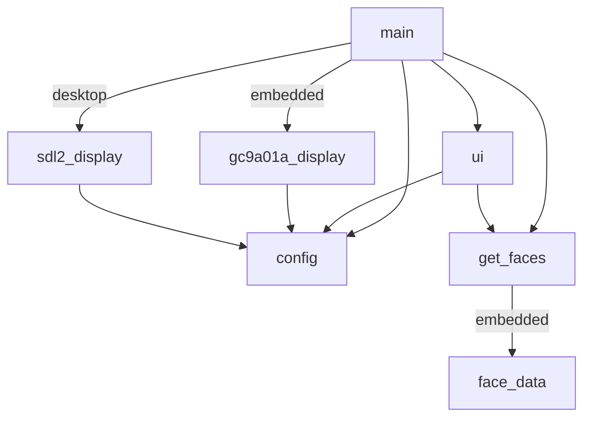
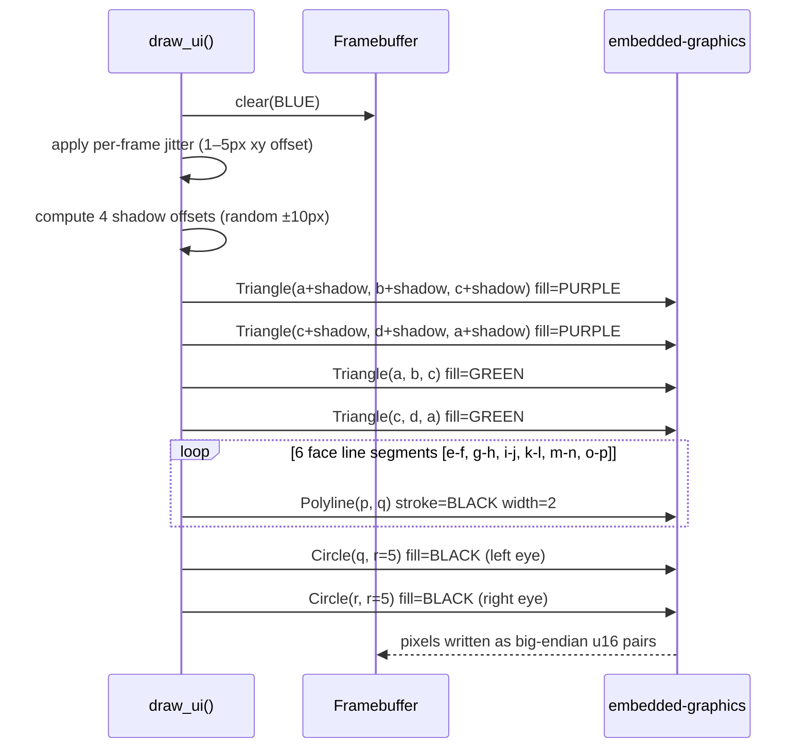
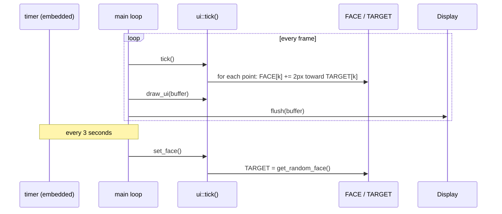
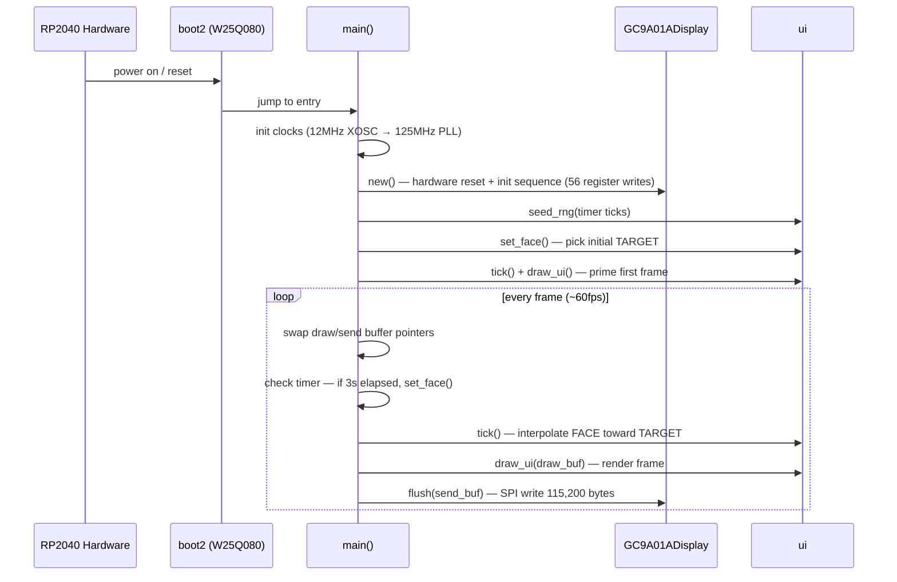

# lilbud

Lil Bud is a tamagotchi-inspired character for embedded systems, written in Rust. He is a small animated face that smoothly morphs between expressions, drawn from face data generated by [lil bud maker](https://github.com/zapplebee/lilbudmaker).

He runs on a [Waveshare RP2040-LCD-1.28](https://www.waveshare.com/rp2040-lcd-1.28.htm) — a 240×240 round GC9A01A display on a tiny RP2040 board, worn like a pin.


---

## Stack

### Hardware

| Component | Part |
|-----------|------|
| MCU | Raspberry Pi RP2040 (dual-core Cortex-M0+, 133 MHz) |
| Board | [Waveshare RP2040-LCD-1.28](https://www.waveshare.com/rp2040-lcd-1.28.htm) |
| Display | GC9A01A — 240×240 round TFT, RGB565, SPI |
| Interface | SPI1 at 40 MHz |
| Flash | W25Q080 (2MB) |

#### SPI Pinout

| Signal | GPIO |
|--------|------|
| SCK    | 10   |
| MOSI   | 11   |
| RST    | 12   |
| DC     | 8    |
| CS     | 9    |
| BL     | 25   |

CS is held permanently LOW after reset. RST is pulsed (HIGH → 100ms → LOW → 100ms → HIGH) to hardware-reset the display before init.

### Software

| Crate | Version | Role |
|-------|---------|------|
| `rp2040-hal` | 0.10 | RP2040 peripherals, SPI, clocks, DMA |
| `cortex-m` / `cortex-m-rt` | 0.7 | Cortex-M0+ runtime, `#[entry]` |
| `embedded-hal` | 0.2 + 1.0 | HAL traits for SPI, GPIO |
| `embedded-graphics` | 0.8 | Drawing primitives (triangles, polylines, circles) |
| `heapless` | 0.8 | `no_std` map (`FnvIndexMap`) for face points |
| `portable-atomic` | 1 | `AtomicU32` on single-core Cortex-M0+ |
| `panic-halt` | 0.2 | Halt on panic (display retains GRAM for debugging) |
| `rp2040-boot2` | 0.3 | W25Q080 second-stage bootloader |
| `sdl2` | 0.35 | Desktop preview window (desktop feature only) |
| `serde` / `serde_json` | 1.0 | Face data deserialization (desktop only) |
| `rand` | 0.8 | RNG for desktop face selection and jitter |

### Build Targets

| Feature flag | Target triple | Use |
|---|---|---|
| `embedded` (default) | `thumbv6m-none-eabi` | Runs on the RP2040 pin |
| `desktop` | `aarch64-apple-darwin` / `x86_64-...` | SDL2 preview window |

---

## External Docs

- [Waveshare RP2040-LCD-1.28 Wiki](https://www.waveshare.com/wiki/RP2040-LCD-1.28) — schematic, pinout, source code structure
- [GC9A01A Datasheet](https://www.buydisplay.com/download/ic/GC9A01A.pdf) — display controller register reference
- [rp2040-hal docs](https://docs.rs/rp2040-hal/latest/rp2040_hal/) — HAL API reference
- [embedded-graphics docs](https://docs.rs/embedded-graphics/latest/embedded_graphics/) — drawing primitives
- [lil bud maker](https://github.com/zapplebee/lilbudmaker) — face data generator

---

## Project Structure

```
lilbud/
├── src/
│   ├── main.rs              # Entry points: desktop (SDL2 loop) + embedded (#[entry])
│   ├── config.rs            # WIDTH=240, HEIGHT=240
│   ├── get_faces.rs         # Face loading: serde_json on desktop, static array on embedded
│   ├── face_data.rs         # Auto-generated: static face arrays (do not edit)
│   ├── ui.rs                # Framebuffer, animation state, draw_ui()
│   ├── sdl2_display.rs      # Desktop: SDL2 canvas wrapper (RGB565 → screen)
│   └── gc9a01a_display.rs   # Embedded: GC9A01A SPI driver, init sequence, flush()
├── gen_faces.py             # Codegen: NDJSON → src/face_data.rs
├── faces.ndjson             # Bundled face data (subset for quick builds)
├── Cargo.toml
├── memory.x                 # RP2040 linker script
├── .cargo/config.toml       # Default target: thumbv6m-none-eabi, runner: elf2uf2-rs
├── README.md
└── BUILDING.md              # Full build and flash instructions
```

### Module Dependencies



---

## Face Data Pipeline

Faces are authored in [lil bud maker](https://github.com/zapplebee/lilbudmaker), exported as NDJSON, then baked into the firmware at compile time.

```mermaid
sequenceDiagram
    participant LBM as lil bud maker
    participant NDJSON as lilbudz.ndjson
    participant Gen as gen_faces.py
    participant FD as src/face_data.rs
    participant Cargo as cargo build

    LBM->>NDJSON: export face sessions
    Note over NDJSON: one JSON object per line<br/>{"level":"info","message":{"emo":"happy","points":{...}}}
    NDJSON->>Gen: python3 gen_faces.py lilbudz.ndjson
    Gen->>FD: emit pub static FACE_DATA: &[[(i32,i32); 18]]
    Note over Gen,FD: applies transform: x = x//2 + 50<br/>           y = y//2 + 50
    FD->>Cargo: included via mod face_data;
    Cargo-->>FD: compiled into firmware (no runtime parsing)
```

Each line in the NDJSON is a log entry with this shape:

```json
{"level":"info","message":{"emo":"happy","points":{"a":{"x":40,"y":0},...,"r":{"x":200,"y":140}}}}
```

### Face Point Map

Points are labeled `a` through `r` (18 total):

| Points | Feature |
|--------|---------|
| `a`, `b`, `c`, `d` | Head quad (two triangles: `a-b-c` and `c-d-a`) |
| `e-f`, `g-h`, `i-j`, `k-l`, `m-n`, `o-p` | Face line segments (brows, nose, mouth) |
| `q`, `r` | Eyes (filled circles, radius 5) |

Coordinates are scaled during codegen: `x = x // 2 + 50`, `y = y // 2 + 50`, keeping the face centered in the 240×240 canvas.

---

## Rendering Pipeline

Each call to `draw_ui()` renders one frame into a `[u8; 240 * 240 * 2]` big-endian RGB565 framebuffer:



The framebuffer is then sent to the display in a single `spi.write(buffer)` call (115,200 bytes over SPI1 at 40 MHz).

---

## Animation

Lil Bud interpolates between two face states each frame:



- **`FACE`** — current displayed face, updated each tick
- **`TARGET`** — destination face; points step 2px per tick (linear interpolation)
- **`set_face()`** — picks a new random `TARGET` from `FACE_DATA`
- **Jitter** — a small random offset (1–5px) is added to all points each frame via LCG RNG, giving a wobbly, alive feeling

---

## Main Loop

### Embedded



### Desktop

The desktop loop mirrors the embedded loop but uses SDL2 for windowing and `std::thread::sleep(16ms)` to cap at ~60fps. Face selection happens on a 3-second timer using `std::time::Instant`.

---

## Build

See **[BUILDING.md](BUILDING.md)** for full instructions. Quick reference:

```sh
# Desktop preview (macOS Apple Silicon)
FACE_FILE_PATH=/path/to/lilbudmaker/lilbudz.ndjson \
  cargo run --target aarch64-apple-darwin --no-default-features --features desktop

# Embedded — regenerate face data, then build + flash
python3 gen_faces.py /path/to/lilbudmaker/lilbudz.ndjson > src/face_data.rs
cargo build --release --no-default-features --features embedded
elf2uf2-rs target/thumbv6m-none-eabi/release/lilbud target/lilbud.uf2
cp target/lilbud.uf2 /Volumes/RPI-RP2/
```

---

## Controls (desktop only)

| Key | Action |
|-----|--------|
| Escape | Quit |

Face changes happen automatically every 3 seconds on both targets.
